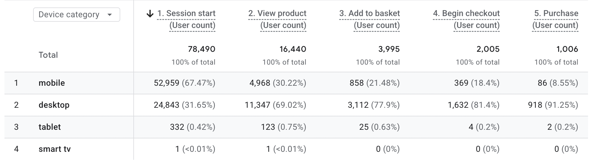
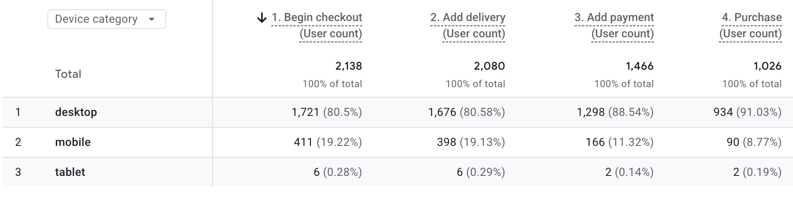
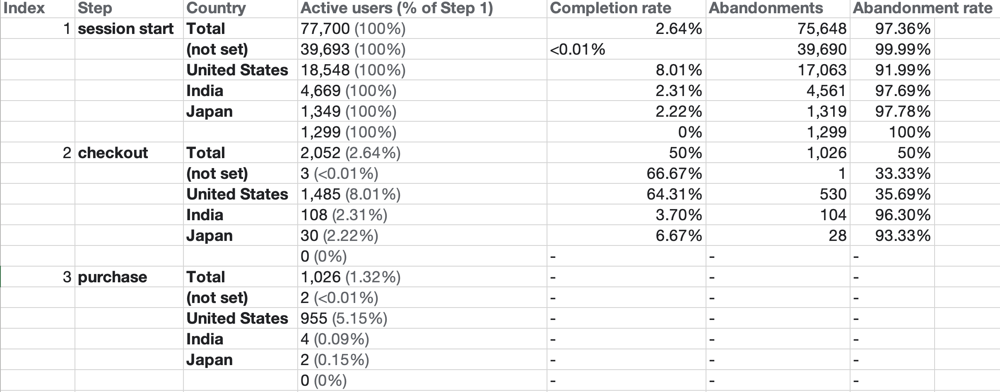

# GA4_Website_Performance

The purpose of this project is to use Google Analytics to assess and demonstrate an e-commerce website's potential for growth in terms of website acquisition, user engagement, and conversion performance. Data from July 20 to August 16 is used.

# Traffic Acquisition

With the highest website traffic, Direct channel is in the lead.  However, with a percentage of 88.24, Email channel is bringing in the highest engagement. Additionally, Organic Search outperforms paid search in terms of traffic, with a difference of %19.03; however, engagement ratios are rather similar, with a difference of only %1.26, while Paid Search has an engagement rate of %71.72 and Organic Search has %70.46. 
Additionally, a significant amount of traffic is categorised as Unassigned, suggesting a possible monitoring or attribution problem.

# Landing Page Performance

The homepage has the highest traffic and revenue compare the other pages. 

A significant share of sessions has no landing page value (not set), limiting the reliability of landing-page performance analysis and warranting further tracking investigation.

Even though The /shop/apparel receives low traffic, it has the highest average engagement time of any major landing page with a high key event rate. 

With 676 sessions and $17,705 in revenue, The /checkout page has a high level of engagement. Check-out pages, on the other hand, are typically regarded as late-stage pages. This indicates that a large number of consumers have already reached the check-out page. 

The /shop/new landing page experienced a significant traffic spike on July 29, reaching 908 sessions versus an expected 73. The increase was primarily associated with Chrome users, Direct traffic and visitors from the United States. The page combined strong engagement and conversion performance with a significant traffic spike, making it a potential growth opportunity worth investigating further.
The /shop/new attracts significantly less traffic than the homepage but demonstrates stronger engagement and session key event performance, suggesting that visitors landing on new products may have higher purchase intent. 

# Purchase Journey

Mobile is the primary traffic source by device, but desktop users account for the vast majority of purchases, indicating a significant mobile conversion opportunity.

# Checkout Journey

Mobile checkout-to-purchase is only 21.9%, whereas desktop checkout-to-purchase is 54.3%. In other words, compared to desktop users, mobile users have a far lower purchase completion rate once they begin the checkout process. 

It is acknowledged that the prior analysis revealed a low general purchase conversion rate on mobile devices. This analysis demonstrates that the issue persists at the checkout level as well. 

# Funnel Exploration

In addition to having the most traffic, the US has a very high checkout success rate compare to India and Japan. 

Only four of the 108 consumers in India complete the checkout process. This indicates that there are a significant number of drop-offs at the journey's checkout stage. 

# Key Findings

- Email demonstrates that high-intent traffic can achieve stronger engagement. Improving SEO and GEO visibility could help attract more high-intent users through organic and emerging search channels, while optimizing the direct landing experience could improve engagement among existing Direct visitors.

- Although it generated fewer engaged sessions, Paid Search outperformed Organic Search in terms of engagement rate, indicating a chance to boost qualified traffic through improved audience segmentation and greater alignment between search intent, ad messaging, and landing pages.

- Purchase journey of mobile users shows drop-offs in early stages. The problem might be resolved by giving mobile UX optimisation top priority by examining product discovery, navigation, page speed, and checkout usability to lower drop-off across the mobile purchase journey.

- Mobile users generated 67.47% of sessions but only 8.55% of purchases during the checkout stage, indicating a significant mobile conversion gap throughout the purchase process. The payment section during the checkout stage is the main source of the problem. Improving mobile checkout usability, particularly around payment entry, could help reduce friction and increase mobile purchase conversion.

- Investigating checkout friction in India, such as payment methods, pricing, shipping costs, or localisation, could assist resolve problems during the purchase process. 

