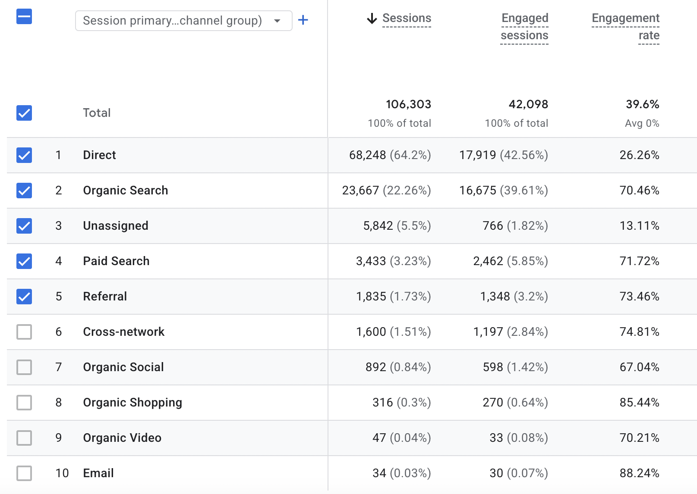
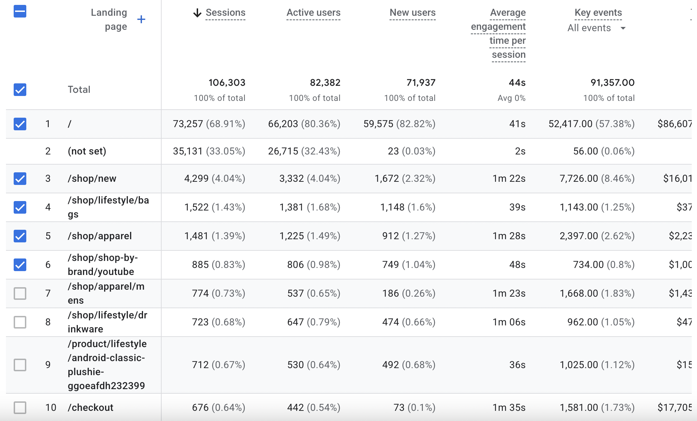
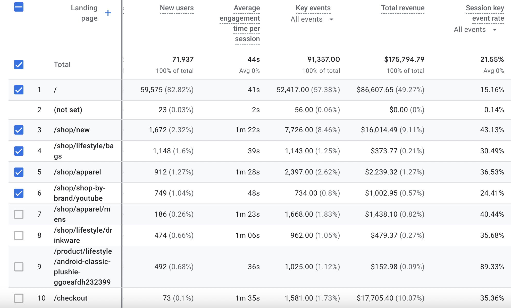
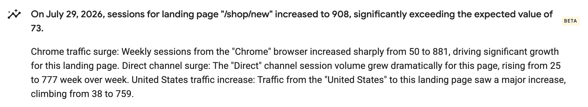

# GA4_Website_Performance

The purpose of this project is to use Google Analytics to assess and demonstrate an e-commerce website's potential for growth in terms of website acquisition, user engagement, and conversion performance. Data from July 20 to August 16 is used.

# Traffic Acquisition

With the highest website traffic, Direct channel is in the lead.  However, with a percentage of 88.24, Email channel is bringing in the highest engagement. Additionally, Organic Search outperforms paid search in terms of traffic, with a difference of %19.03; however, engagement ratios are rather similar, with a difference of only %1.26, while Paid Search has an engagement rate of %71.72 and Organic Search has %70.46. 
Additionally, a significant amount of traffic is categorised as Unassigned, suggesting a possible monitoring or attribution problem.

# Landing Page Performance

The homepage has the highest traffic and revenue compare the other pages. 
A significant share of sessions has no landing page value (not set), limiting the reliability of landing-page performance analysis and warranting further tracking investigation.
Even though The /shop/apparel receives low traffic, it has the highest average engagement time of any major landing page with a high key event rate. 
With 676 sessions and $17,705 in revenue, The /checkout page has a high level of engagement. Check-out pages, on the other hand, are typically regarded as late-stage pages. This indicates that a large number of consumers have already reached the check-out page. 
The /shop/new landing page experienced a significant traffic spike on July 29, reaching 908 sessions versus an expected 73. The increase was primarily associated with Chrome users, Direct traffic and visitors from the United States. The page combined strong engagement and conversion performance with a significant traffic spike, making it a potential growth opportunity worth investigating further.
The /shop/new attracts significantly less traffic than the homepage but demonstrates stronger engagement and session key event performance, suggesting that visitors landing on new products may have higher purchase intent. 

